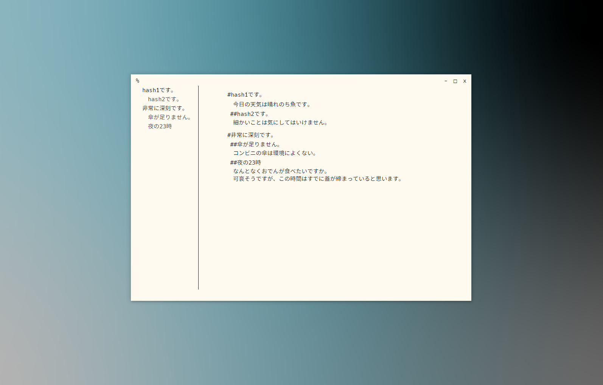

# fish-in-txt [魚は文字の中]



fish-in-txtはシンプルなテキストエディタです。


可愛いtext fish

## run & install

以下の手順で簡単にビルドできます。  

```bash
git clone https://github.com/k-o-s-h/fish-in-txt.git
cd sakana
nmp install
nmp start
```

## 特徴

* このアプリケーションはelectronを使用して作成されています。  
* 外部JSファイルを使用せずにエディタを作成しています。

## あぷで

### Yesterday[済]

* "#"を用いて主題と副題を設定できます。
* 自動で主題と副題を取得して、indexを作成します。
* ファイルの読み込みと保存ができます。一度 [読み込み] または [保存] を行った場合、保存は上書き保存となります。
* 未保存状態でwindowを閉じた場合の確認画面
* "CTRL + S"で保存できます。

### Tomorrow[未]

* indexクリック時のジャンプをスムーススクロールに対応
* CSSファイルのユーザー変更
* シンタックスハイライト系

## Sono他

* See the License file for [license](LICENSE) rights and limitations (MIT)